# Synthetic Data Research - 合成数据研究

这是一个关于合成数据生成的综合性研究仓库,旨在为初学者和研究者提供一个从理论基础到实践应用的全方位知识体系。我们系统地梳理了合成数据领域的关键概念、核心方法、应用场景、前沿趋势和伦理风险,并提供了丰富的学术资源和工业界实践案例。

## 知识体系思维导图

我们构建了一个全面的知识体系,并通过思维导图进行可视化,帮助您快速掌握合成数据领域的全貌。您可以从任何一个节点开始探索,并深入到您感兴趣的具体领域。

```mermaid
graph TD
    A[合成数据研究] --> B[01-理论基础];
    A --> C[02-核心方法];
    A --> D[03-应用领域];
    A --> E[04-关键技术];
    A --> F[05-质量评估];
    A --> G[06-前沿趋势];
    A --> H[07-伦理与风险];
    A --> I[08-工业实践];
    A --> J[09-学术资源];
    A --> K[10-最新趋势-2026];

    B --> B1[GANs];
    B --> B2[VAEs];
    B --> B3[扩散模型];
    B --> B4[其他方法];

    C --> C1[深度生成模型];
    C --> C2[统计方法];
    C --> C3[基于规则的方法];

    D --> D1[计算机视觉];
    D --> D2[自然语言处理];
    D --> D3[时间序列];
    D --> D4[表格数据];

    E --> E1[隐私保护];
    E --> E2[小样本学习];
    E --> E3[域随机化];
    E --> E4[可控生成];

    F --> F1[保真度];
    F --> F2[多样性];
    F --> F3[实用性];
    F --> F4[隐私性];

    G --> G1[LLMs与合成数据];
    G --> G2[世界模型];
    G --> G3[跨模态生成];

    H --> H1[偏见问题];
    H --> H2[数据完整性];
    H --> H3[缓解策略];

    I --> I1[NVIDIA案例];
    I --> I2[开源工具];
    I --> I3[最佳实践];

    J --> J1[论文列表];
    J --> J2[数据集];
    J --> J3[基准测试];

    K --> K1[物理AI崛起];
    K --> K2[合成数据工厂];
    K --> K3[世界模型];
    K --> K4[端到端AI];
```

## 快速导航

- **[Researches](./researches/)**: 所有研究内容的根目录,包含详细的报告和笔记。
- **[2026最新趋势](./researches/10-latest-trends-2026/)**: 截至2026年2月的最新研究成果、行业动态和技术突破。

### 核心理论
- **[生成对抗网络 (GANs)](./researches/01-theoretical-foundations/gans/)**: 博弈论基础、纳什均衡、训练稳定性。
- **[变分自编码器 (VAEs)](./researches/01-theoretical-foundations/vaes/)**: 变分推断、ELBO推导、重参数化技巧。
- **[扩散模型 (Diffusion Models)](./researches/01-theoretical-foundations/diffusion-models/)**: 随机微分方程、分数匹配、去噪过程。

### 关键应用
- **[计算机视觉](./researches/03-application-domains/computer-vision/)**: 图像生成、目标检测、语义分割。
- **[自然语言处理](./researches/03-application-domains/nlp/)**: 文本生成、数据增强、对话系统。
- **[NVIDIA实践案例](./researches/08-industry-practices/nvidia-case-study/)**: Omniverse、Isaac Sim、Nemotron。

## 学习路径建议

我们为不同背景的学习者设计了不同的学习路径,帮助您快速入门并深入探索。

### 🚀 初学者路径

**目标**: 快速建立对合成数据领域的整体认知,了解核心概念和应用。

1.  **理论入门**: 从 **[理论基础](./researches/01-theoretical-foundations/)** 开始,重点理解GANs、VAEs、Diffusion Models的基本思想,无需深究数学细节。
2.  **应用概览**: 浏览 **[应用领域](./researches/03-application-domains/)**,了解合成数据在不同场景下的价值。
3.  **质量评估**: 学习 **[质量评估](./researches/05-quality-evaluation/)** 的基本概念,知道如何衡量合成数据的好坏。
4.  **前沿动态**: 关注 **[前沿趋势](./researches/06-emerging-trends/)**,了解该领域的最新发展。

### 🎓 研究者路径

**目标**: 深入理解理论细节,探索方法创新和理论边界。

1.  **理论深潜**: 精读 **[理论基础](./researches/01-theoretical-foundations/)** 中的数学推导和原始论文,掌握核心模型的理论精髓。
2.  **方法创新**: 研究 **[核心方法](./researches/02-core-methods/)** 和 **[关键技术](./researches/04-key-technologies/)**,探索新的生成方法或改进现有模型。
3.  **严谨评估**: 在 **[质量评估](./researches/05-quality-evaluation/)** 框架下对新方法进行严格的实验验证。
4.  **伦理思考**: 深入研究 **[伦理与风险](./researches/07-ethics-and-risks/)**,提出缓解策略。

### 💼 工程师路径

**目标**: 快速掌握实用工具和工程实践,将合成数据技术应用于实际项目。

1.  **工具上手**: 直接进入 **[工业实践](./researches/08-industry-practices/)**,学习NVIDIA Omniverse、SDV等开源工具的使用。
2.  **案例参考**: 参考 **[应用领域](./researches/03-application-domains/)** 的案例,了解不同场景下的解决方案。
3.  **工程优化**: 学习 **[关键技术](./researches/04-key-technologies/)** 中的Sim2Real、可控生成等工程技巧。
4.  **部署实践**: 遵循 **[工业实践](./researches/08-industry-practices/best-practices/)** 中的最佳实践,建立数据生成、评估和部署的流水线。

## 贡献指南

我们欢迎社区的任何贡献! 您可以通过以下方式参与:

- **内容补充**: 撰写新的研究报告、技术笔记或案例分析。
- **资源推荐**: 推荐优质的论文、工具、数据集或教程。
- **错误修正**: 发现并修正文档中的错误或不准确之处。
- **参与讨论**: 在 [Issues](https://github.com/DemonDamon/synthetic-data-research/issues) 中提出问题、分享见解。

在提交贡献前,请阅读我们的 **[贡献指南](./CONTRIBUTING.md)**。

## 许可证

本仓库的所有内容均采用 [MIT License](./LICENSE) 授权。您可以自由地使用、修改和分发本仓库的内容,但请注明出处。

## 致谢

本仓库的构建离不开开源社区和各位贡献者的支持。特别感谢以下项目和社区提供的宝贵资源:

- [Papers with Code](https://paperswithcode.com/)
- [Hugging Face](https://huggingface.co/)
- [NVIDIA Developer](https://developer.nvidia.com/)
- 以及所有被引用的研究论文的作者们。

---

**最后更新**: 2026-02-26
